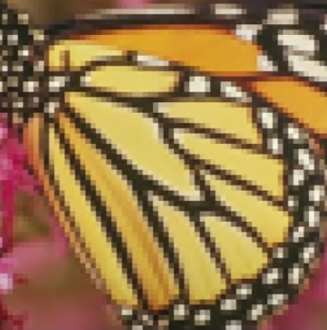

# ComputerVisionProjects
My computer vision projects.
Currently include:

- U-Net image segmentation
- ResNet
- Mobile net scaled with EfficientNet methodology, good for small computer resources
- Image captioning (adding a caption describing an image)
- Image upscaling (SRGAN & ESRGAN)

  
   

- [YOLOv3 for car and license plate detection + OCR for license plate reading - all from scratch](https://github.com/JolaKl/soft_kompjuting)
